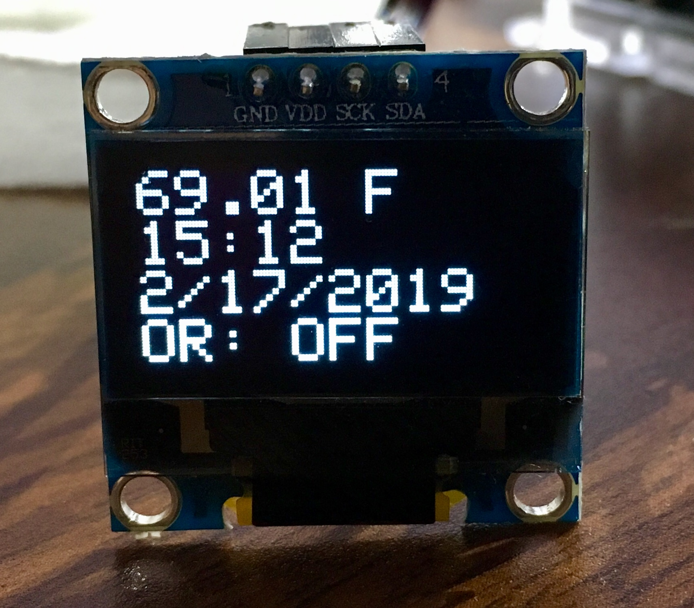

# Explanation of Arduino Controller Code

**author: Joshua Cook**

**date: 2019-02-10**

## Overview

For those new to Arduino, there are two essential functions: `setup()` and `loop()`. Both are `void` (ie. there return no value). `setup()` runs once at the beginning upon start up of the machine, and `loop()` is the main function that continously loops forever - this is where the main commands of the code run.

The main purpose of the code is to check the time and set the lights appropriately. The temperature, time, date, and status of the "over-ride switch" are printed to a small (cheap) OLED screen. The complexity of the code is introduced by my over-ride button. Pressing this switches the lights to their opposite state (if they are on, it turns them off, and vice versa) and over-rides the timer. Pressing the button again, restores control to the timer.


## The Code

### Header section (runs before `setup()`)

First, I load the libraries I am using. The `OneWire.h` and `DallasTemperature.h` libraries are for the SSD1306 temperature sensor. `Wire.h` is the I2C library. `RTC.h` is for the real-time clock module. `Adafruit_SSD1306.h` are for the OLED screen.
The `GrowLight.h` is my own library that makes the lights a new class. I implemented this in the second version of the code to reduce complexity of the code and make it more robust. You can read about the details here: [Explanation of the GrowLight Class](./growlight_class_walkthrough.md "Explanation of the GrowLight Class").

```c
#include <OneWire.h> 
#include <DallasTemperature.h>
#include <Wire.h>
#include <RTClib.h>
#include <Adafruit_SSD1306.h>
#include "GrowLight.h"
```

I then initialize all of the modules. You can see which ones correspond to which piece in the comments.

```c
// initiate RTC module object
RTC_DS3231 rtc;

// IO pins
int relayPin = 7;
int buttonPin = 6;

// OLED declarations
#define OLED_RESET -1
Adafruit_SSD1306 display(OLED_RESET);

// one-wire SSD1306 declarations
#define ONE_WIRE_BUS 10
#define SSD1306_128_64
OneWire oneWire(ONE_WIRE_BUS);
// Pass our oneWire reference to Dallas Temperature.
DallasTemperature sensors(&oneWire);  // Pass our oneWire reference to Dallas Temperature.

// self-defined grow-lights object
GrowLight gl(relayPin, 10, 22);
```

The only one I will comment on is the last line `GrowLight gl(relayPin, 10, 22)`. This is the new class I defined and it accepts 3 values upon initialization: the pin to turn the lights ON or OFF, the hour of when to turn the lights ON, and the hour on when to turn the lights OFF. I made a walk-through tutorial for this library, too ([Explanation of the GrowLight Class](./growlight_class_walkthrough.md "Explanation of the GrowLight Class")).

### The setup function

Finally, the `setup()` function. Here is it in full, and I broke it down below.

```c
void setup() {
    pinMode(LED_BUILTIN, OUTPUT);
    
    // begin RTC
    rtc.begin();
    
    // setup the OLED display
    display.begin(SSD1306_SWITCHCAPVCC, 0x3C);
    display.clearDisplay();
    display.display();
    
    // begin one-wire temp sensor
    sensors.begin();
    
//    if (rtc.lostPower()) {
//        Serial.println("RTC lost power, lets set the time!");
//        // following line sets the RTC to the date & time this sketch was compiled
//        rtc.adjust(DateTime(F(__DATE__), F(__TIME__)));
//    }
    
    // declare IO
    pinMode(buttonPin, INPUT);

    // pause before starting to control the lights
    delay(3000);
}
``` 

I begin by designating the built-in LED as an output. 

```c
pinMode(LED_BUILTIN, OUTPUT);
```

Then, the `rtc` object is started.

```c
// begin RTC
rtc.begin();
```

The OLED screen is initiated with a blank screen. If you use this code, and the screen does not display anything, try using the address `0x3D` - it's usually one of these two. Note, when using this library, don't forget to call the `.display()` method to actually produce an image (in this case blank) on the screen.

```c
// setup the OLED display
display.begin(SSD1306_SWITCHCAPVCC, 0x3C);
display.clearDisplay();
display.display();
```

Next, the temperature sensor in started.

```c
// begin one-wire temp sensor
sensors.begin();
```

The commented out section is code that will reset the RTC time to the current time if it is disconnected from its power source. I leave this commented out because it only works when connected to a computer, not a wall-wart as I currently have it.

```c
if (rtc.lostPower()) {
	Serial.println("RTC lost power, lets set the time!");
	// following line sets the RTC to the date & time this sketch was compiled
	rtc.adjust(DateTime(F(__DATE__), F(__TIME__)));
}

```

I declare the input/output pin for the button as `OUTPUT`.

```c
// declare IO
    pinMode(buttonPin, INPUT);
```

Finally, I add a slight delay before taking control of the lights because I noramlly plug in the Arduino and then the lights.

```c
delay(3000);
```

### The loop function

Here is the entire `loop()` function that I then decompose below. On each loop, current date and time is collected, the screen is updated, the built-in LED is turned according to the over-ride button status, the lights are updated, and the function waits for a button press. 

```c
void loop() {
    // print useful info. to Serial
    DateTime now = rtc.now();
    
    // print the current temperature
    printScreen(now, gl.getOverrideStatus());
    
    // builtin-led ON/OFF according to over-ride status
    digitalWrite(LED_BUILTIN, gl.getOverrideStatus());
    
    // check the current time against the time limits
    gl.updateLights(now.hour());
    
    // check time every 15 sec, otherwise look for button presses
    int checkTimeDelay = 2000;
    unsigned long start_timer = millis();
    unsigned long end_timer = start_timer;
    while(end_timer >= start_timer && checkTimeDelay > (end_timer - start_timer)) {
        int buttonState = digitalRead(buttonPin);
        if (buttonState == HIGH) {
            gl.overrideLights(now.hour());
            Serial.println("button pressed");
            digitalWrite(LED_BUILTIN, gl.getOverrideStatus());
            delay(500);
            break;
        }
        delay(50);
        end_timer = millis();
    }
}
```

#### Step 1. collect current date and time

Request current information from the RTC module.

```c
// print useful info. to Serial
DateTime now = rtc.now();
```

#### Step 2. update user interface

The screen is updated with current temperature, time, date, and the status of the over-ride button. The `printScreen` function is elaborated on below. The built-in LED is switched ON or OFF according to the over-ride button.

```c
// print the current temperature
printScreen(now, gl.getOverrideStatus());
    
// builtin-led ON/OFF according to over-ride status
digitalWrite(LED_BUILTIN, gl.getOverrideStatus());
```

#### Step 3. update the lights

I have included a method in the `GrowLight` class called `.updateLights` that takes the current time and checks it against the ON and OFF hours for the lights. It also takes into account the over-ride status. This functionality was the main reason I wanted to create the `GrowLight` library. It packaged all of the information for the lights into a single object instead of relying on the careful tracking of global variables.

```c
// check the current time against the time limits
gl.updateLights(now.hour());
```

#### Step 4. wait for button press

`int checkTimeDelay` holds a value for how long to wait for a button press (in milliseconds). I start a timer with `unsigned long start_timer = millis();`, and assign the same value to `unsigned long end_timer`. By subtracting these two values on each loop of the `while`, I have created a timer. If this timer reaches `checkTimeDelay`, then the `while` stops and `loop()` continues.

Inside of the `while` statement, the state of the button is constantly checked, waiting to be pressed. If it isn't pressed, there is a bit of a delay (50 ms) and the `end_timer` variable is updated.

If the button is pressed, the `gl` object's over-ride status is switched using the `.overrideLights` method and the lights are switched to the approriate state. The built-in LED is turned to reflect the status of the over-ride button, and there is a half-second delay to prevent double presses from accidentally registering.

Within the `.overrideLights` method, if the over-ride status is swtiched from OFF to ON, then the lights are simply switched to their opposite state. However, if the over-ride status is switched from ON to OFF, then the method uses the `.updateLights` method to return control back to the lights. This simple implementation of specialized logic is the second reason why I needed to create the `GrowLight` library.

```c
// check time every 15 sec, otherwise look for button presses
int checkTimeDelay = 2000;
unsigned long start_timer = millis();
unsigned long end_timer = start_timer;
while(end_timer >= start_timer && checkTimeDelay > (end_timer - start_timer)) {
    int buttonState = digitalRead(buttonPin);
    if (buttonState == HIGH) {
        gl.overrideLights(now.hour());
        Serial.println("button pressed");
        digitalWrite(LED_BUILTIN, gl.getOverrideStatus());
        delay(500);
        break;
    }
    delay(50);
    end_timer = millis();
}
```

### Subroutines

The function `printScreen()` was primarily used to remove a block of ugly verbose code out of my `loop()` function. It reads the temperature (in Farenheit) using the two statements `sensors.requestTemperatures();` and `float ftemp = sensors.getTempFByIndex(0);`. 

Next, a string is made depending on the over-ride status for the lights, passed to `printScreen` using the `bool or_status` argument.

Then, there is a whole process for writing the temperature, time, date, and over-ride status to the OLED screen: the display is cleared, text size set, color set, cursor positioned, the statement printed, and the display is shown (`.display()` method). I add a delay to prevent any quick accidental repeat calls to set the display.

```c
// print the temperature to the OLED display
void printScreen(DateTime dt, bool or_status) {
    // call sensors.requestTemperatures() to issue a global temperature
    // request to all devices on the bus
    sensors.requestTemperatures(); // Send the command to get temperature readings
    float ftemp = sensors.getTempFByIndex(0);  // 0 refers to the first IC on the wire

    String or_string;
    if (or_status) {
        or_string = "OR: ON";
    } else {
        or_string = "OR: OFF";
    }
    
    // setup display
    display.clearDisplay();
    display.setTextSize(2);
    display.setTextColor(WHITE);
    display.setCursor(0,0);

    // line 1: print temperature
    display.print(ftemp);
    display.println(" F");

    // line 2: time
    display.print(dt.hour(), DEC);
    display.print(":");
    display.println(dt.minute(), DEC);

    // line 3: date
    display.print(dt.month(), DEC);
    display.print("/");
    display.print(dt.day(), DEC);
    display.print("/");
    display.println(dt.year(), DEC);

    // line 4: override status:
    display.print(or_string);

    // print to screen
    display.display();
    delay(100);
}
```

Here is an example of what the screen looks like:



---
### TODO

Some minor issues are logged in my Project tab of the GitHub repo, but nothing major is in the works.